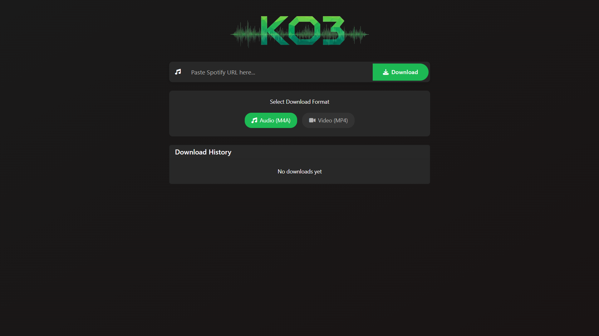
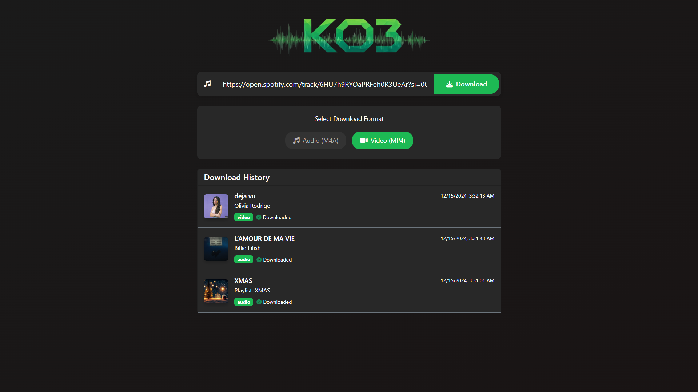
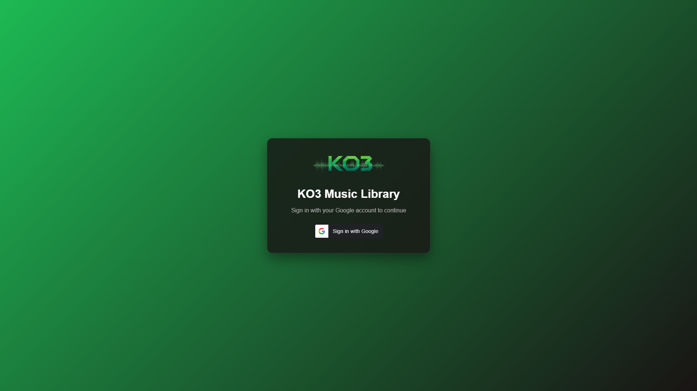
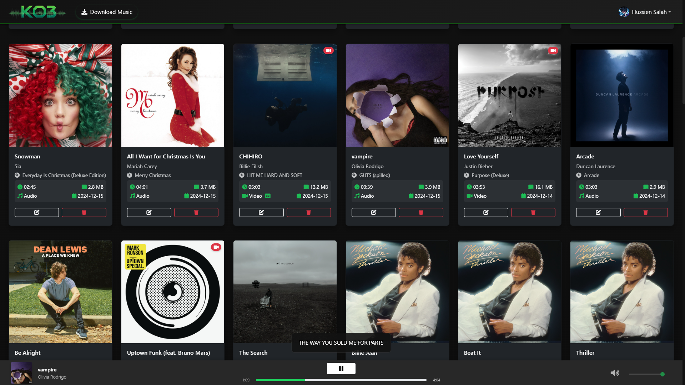
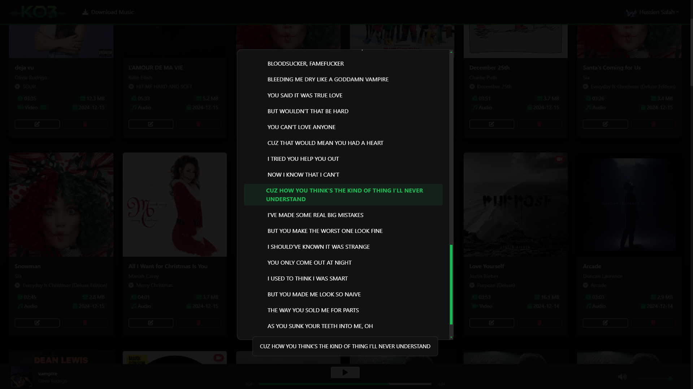
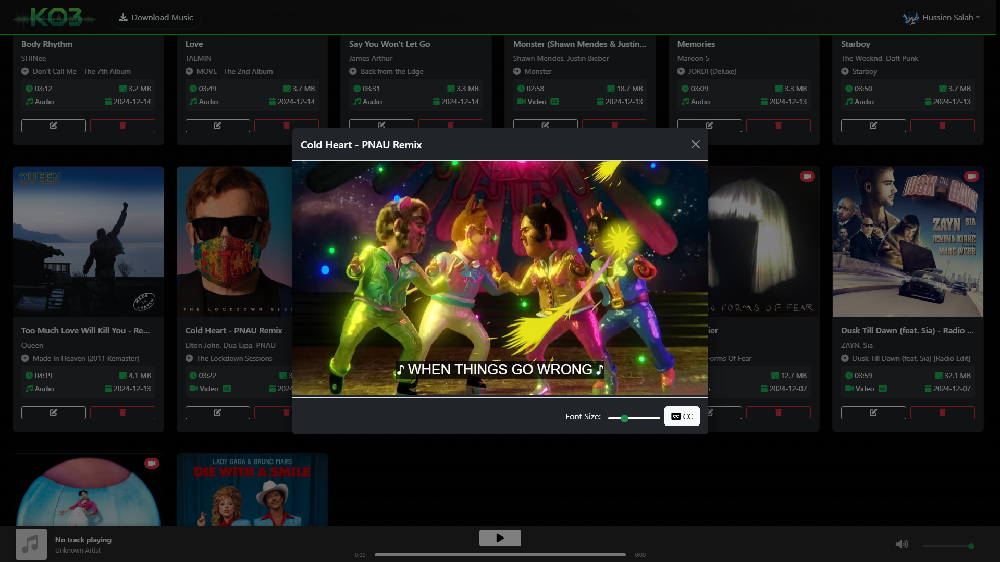
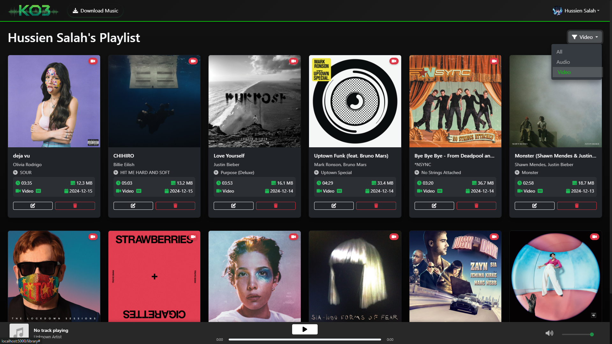

<p align="center">
  
</p>
# KO3 Music Player

A powerful web-based music player with Spotify integration, developed in collaboration with [Hassan Salah](https://github.com/hassansalah120/).

A powerful web-based music player that allows you to download and manage your Spotify playlists. Built with Flask and integrates with Spotify API for seamless playlist management and YouTube for high-quality audio downloads.

## Screenshots

### Main Interface

*Main interface of KO3 Music Player*

### Library View with Downloaded Songs

*Library view showing downloaded songs and playlists*

### Google Authentication

*Secure login with Google authentication*

### Music Library

*Organized music library with search and filter options*

### Playback Features

*Music playback with synchronized lyrics overlay*

### Lyrics View

*Detailed lyrics view with scrollable text*

### Video Playback

*Mini video player with caption and font controls*


*Fullscreen video playback mode*

### Advanced Features

*Advanced filtering and sorting options*

## Features

- 🎵 Download tracks from Spotify playlists
- 🎥 Support for both audio and music video downloads
- 📝 Automatic lyrics/subtitles download and display
- 🎨 Beautiful and responsive web interface
- 🔒 Secure Google OAuth Authentication
- 📚 Create and manage custom playlists
- 📋 View download history
- 🎬 Video player with subtitle support
- 🔍 Smart search and filtering options

## Prerequisites

- Python 3.x
- Spotify Developer Account
- Google Developer Account (for OAuth)

## Installation

1. Clone the repository:
```bash
git clone https://github.com/Kingof3O/ko3-music-player.git
cd ko3-music-player
```

2. Install dependencies:
```bash
pip install -r requirements.txt
```

3. Set up environment variables:
   - Copy `.env.template` to `.env`
   - Fill in your credentials:
     - `GOOGLE_CLIENT_ID`: Your Google OAuth client ID
     - `FLASK_SECRET_KEY`: A secure random string for Flask
     - `SPOTIFY_CLIENT_ID`: Your Spotify API client ID
     - `SPOTIFY_CLIENT_SECRET`: Your Spotify API client secret

4. Initialize the database:
```bash
python src/app.py
```

## Firebase Setup

1. Create a new Firebase project in the [Firebase Console](https://console.firebase.google.com/)
2. Go to Project Settings > Service Accounts
3. Click "Generate New Private Key" to download your service account credentials
4. Create a file named `firebase-key.json` in the `config` directory with the following structure:

```json
{
  "type": "service_account",
  "project_id": "<your-project-id>",
  "private_key_id": "<your-private-key-id>",
  "private_key": "<your-private-key>",
  "client_email": "<your-client-email>@<your-project-id>.iam.gserviceaccount.com",
  "client_id": "<your-client-id>",
  "auth_uri": "https://accounts.google.com/o/oauth2/auth",
  "token_uri": "https://oauth2.googleapis.com/token",
  "auth_provider_x509_cert_url": "https://www.googleapis.com/oauth2/v1/certs",
  "client_x509_cert_url": "https://www.googleapis.com/robot/v1/metadata/x509/<your-service-account-email>"
}
```

5. Add the file path to your `.env` file:
```
FIREBASE_CREDENTIALS_PATH=config/firebase-key.json
```

## Spotify Configuration
1. Create a Spotify Developer account and register your application at [Spotify Developer Dashboard](https://developer.spotify.com/dashboard)
2. Copy your Client ID and Client Secret
3. Create a `config.json` file based on `config.json.template`:
```json
{
    "SPOTIFY_CLIENT_ID": "your_spotify_client_id",
    "SPOTIFY_CLIENT_SECRET": "your_spotify_client_secret"
}
```

## Usage

1. Start the Flask server:
```bash
python src/app.py
```

2. Open your browser and navigate to `http://localhost:5000`

3. Log in with your Google account

4. Start downloading and managing your music!

## Detailed Project Structure

### Source Code (`src/`)

#### Core Application Files
- `app.py` (37.5 KB)
  - Main Flask application
  - Handles routing and request processing
  - Manages user authentication and sessions
  - Implements WebSocket communication for real-time updates
  - Coordinates between different components (Spotify, database, downloader)

- `spotify_downloader.py` (42.2 KB)
  - Core functionality for downloading content
  - Integrates with Spotify API for track metadata
  - Uses yt-dlp for downloading high-quality audio/video
  - Handles subtitle/lyrics extraction and processing
  - Manages file organization and metadata tagging

#### Database and Models
- `database.py` (23.8 KB)
  - SQLAlchemy database models and operations
  - Manages track, playlist, and user data
  - Handles download history and user preferences
  
- `models/`
  - Contains SQLAlchemy model definitions
  - User authentication and session management

#### Firebase Integration
- `firebase_config.py` (1.9 KB)
  - Firebase initialization and configuration
  - Authentication settings
  
- `firebase_service.py` (4.8 KB)
  - Firebase service implementation
  - User data management
  - Cloud storage integration

#### Utility Modules
- `emit_utils.py` (1.4 KB)
  - WebSocket event emission utilities
  - Real-time progress updates
  
- `db_inspector.py` (3.1 KB)
  - Database inspection and maintenance tools
  - Debugging utilities

### Templates (`templates/`)

- `index.html` (19.9 KB)
  - Main application interface
  - Download form and progress display
  - Real-time status updates
  
- `library.html` (51.1 KB)
  - Music library interface
  - Playlist management
  - Media player integration
  - Advanced filtering and search
  
- `login.html` (4.4 KB)
  - Google OAuth login interface
  - User authentication flow
  
- `error.html` (0.5 KB)
  - Error page template
  - User-friendly error messages

### Static Files (`static/`)

#### CSS Styles
- `css/style.css`
  - Custom styling for all components
  - Responsive design rules
  - Dark/light theme support
  - Media player styling

#### Assets
- `favicon.png`
  - Application icon
- `icons/`
  - UI icons and buttons
- `images/`
  - Static image assets
- `img/`
  - Additional image resources

### Configuration

- `.env.template`
  ```env
  GOOGLE_CLIENT_ID=your_google_client_id
  FLASK_SECRET_KEY=your_secret_key
  SPOTIFY_CLIENT_ID=your_spotify_client_id
  SPOTIFY_CLIENT_SECRET=your_spotify_secret
  ```

- `config.json`
  - Application configuration
  - Feature flags
  - Default settings

### Data Storage

- `data/`
  - SQLite database
  - User preferences
  - Download history
  
- `downloaded_content/`
  - Organized music library
  - Downloaded audio/video files
  - Extracted lyrics/subtitles

## Technical Implementation Details

### Database Schema

#### Downloaded Tracks Table
```sql
CREATE TABLE downloaded_tracks (
    id INTEGER PRIMARY KEY,
    track_id VARCHAR UNIQUE NOT NULL,
    spotify_uri VARCHAR,
    youtube_id VARCHAR,
    title VARCHAR NOT NULL,
    artist VARCHAR NOT NULL,
    album VARCHAR,
    duration INTEGER,
    file_path VARCHAR NOT NULL,
    file_size INTEGER,
    download_date DATETIME,
    last_played DATETIME,
    play_count INTEGER DEFAULT 0,
    is_video BOOLEAN DEFAULT FALSE,
    download_source VARCHAR,
    audio_format VARCHAR,
    audio_quality VARCHAR,
    lyrics_file VARCHAR,
    subtitle_file VARCHAR,
    thumbnail_url VARCHAR,
    additional_metadata TEXT
);
```

#### Playlists Table
```sql
CREATE TABLE playlists (
    id INTEGER PRIMARY KEY AUTOINCREMENT,
    name VARCHAR(500) NOT NULL,
    description TEXT,
    spotify_id VARCHAR(100) UNIQUE,
    created_date DATETIME NOT NULL,
    last_updated DATETIME,
    is_public BOOLEAN DEFAULT TRUE,
    owner VARCHAR(100),
    thumbnail_url VARCHAR(1000)
);
```

#### Download History Table
```sql
CREATE TABLE download_history (
    id INTEGER PRIMARY KEY AUTOINCREMENT,
    total_downloads INTEGER DEFAULT 0,
    total_video_downloads INTEGER DEFAULT 0,
    total_audio_downloads INTEGER DEFAULT 0,
    total_playlists INTEGER DEFAULT 0,
    last_download_date DATETIME,
    total_file_size INTEGER DEFAULT 0,
    spotify_downloads INTEGER DEFAULT 0,
    youtube_downloads INTEGER DEFAULT 0,
    failed_downloads INTEGER DEFAULT 0,
    last_error TEXT,
    last_error_date DATETIME
);
```

### Key Components

#### Database Manager
- Comprehensive SQLAlchemy integration
- Transaction management with context managers
- Automated schema migrations
- Advanced search and filtering
- Download statistics tracking

#### Download Process
1. **URL Processing**
   ```python
   def get_spotify_url_type(url: str) -> str:
       """Determine if URL is track/album/playlist"""
       patterns = {
           'track': r'spotify.com/track/([a-zA-Z0-9]+)',
           'album': r'spotify.com/album/([a-zA-Z0-9]+)',
           'playlist': r'spotify.com/playlist/([a-zA-Z0-9]+)'
       }
       # Pattern matching logic
   ```

2. **Metadata Extraction**
   ```python
   def get_track_metadata(track_obj: Dict) -> Dict:
       """Extract comprehensive track metadata"""
       return {
           'track_id': track_obj['id'],
           'title': track_obj['name'],
           'artist': ', '.join(artist['name'] for artist in track_obj['artists']),
           'album': track_obj['album']['name'],
           'duration': track_obj['duration_ms'],
           'thumbnail_url': track_obj['album']['images'][0]['url']
       }
   ```

3. **Content Download**
   ```python
   def download_content(
       track_name: str,
       artist_name: str,
       download_path: Path,
       format_type: str = 'audio',
       thumbnail_url: Optional[str] = None,
       track_metadata: Optional[dict] = None
   ) -> Optional[str]:
       """Download content with enhanced features"""
       # Download implementation
   ```

#### WebSocket Integration
- Real-time progress updates
- Download status notifications
- Player state synchronization
- Error reporting

#### Security Features
- Input validation and sanitization
- File path security checks
- Content type verification
- Rate limiting
- Session management

### Advanced Features

#### Lyrics Synchronization
- Automatic subtitle extraction
- Timestamp parsing
- Real-time display sync
- Multiple format support (SRT, VTT)

#### Media Player
- Custom controls
- Playlist management
- Progress tracking
- Keyboard shortcuts
- Mini-player mode

#### Search and Filtering
- Full-text search
- Multiple filter criteria
- Sort options
- Pagination support
- Cache optimization

## Key Features Implementation

### Authentication Flow
1. User clicks "Login with Google"
2. OAuth2 flow handled by `firebase_config.py`
3. User credentials stored securely
4. Session management via Flask-Login

### Download Process
1. User submits Spotify URL
2. `spotify_downloader.py` fetches metadata
3. Content downloaded via yt-dlp
4. Metadata and artwork embedded
5. Progress updates via WebSocket

### Media Player
- Custom HTML5 audio/video player
- Lyrics synchronization
- Subtitle support for videos
- Mini-player and fullscreen modes
- Keyboard controls

### Library Management
- SQLAlchemy-based database
- Custom playlist creation
- Smart filtering and search
- Batch operations support
- Download history tracking

## Development Guidelines

### Code Style
- PEP 8 compliance for Python code
- ESLint for JavaScript
- CSS BEM methodology

### Security Measures
- Environment variables for secrets
- CSRF protection
- Secure session handling
- Input sanitization
- XSS prevention

### Performance Optimization
- Async download processing
- WebSocket for real-time updates
- Efficient database queries
- Resource caching
- Lazy loading for media

## Project Structure

- `src/`: Source code files
  - `app.py`: Main Flask application
  - `spotify_downloader.py`: Core downloading functionality
- `static/`: Static files (CSS, JS)
- `templates/`: HTML templates
- `data/`: Database and user data
- `config/`: Configuration files

## Security Notes

- Never commit your `.env` file or any files containing sensitive credentials
- Keep your API keys and secrets secure
- Use environment variables for all sensitive information

## Contributors
- [Hassan Salah](https://github.com/hassansalah120/)
- [Kingof3O](https://github.com/Kingof3O/)


## Contributing

1. Fork the repository
2. Create your feature branch (`git checkout -b feature/AmazingFeature`)
3. Commit your changes (`git commit -m 'Add some AmazingFeature'`)
4. Push to the branch (`git push origin feature/AmazingFeature`)
5. Open a Pull Request

## License

This project is licensed under the MIT License - see the LICENSE file for details
